# Welcome to Oracle Cloud Native Environment Track 

---
This track contains videos to facilitate your usage of the technologies, software and tools used by Oracle to develop microservices-based applications that can be deployed in environments that support open standards and specifications.

On these pages you will find material such as videos, documents and useful resource links covering areas including the following:
- Container Runtime
- Orchestration and Deployment
- Microservices Traffic Management
- Management Operations
- Monitoring

Information and videos presented here cover Microservices technologies which are components of the Oracle Cloud Native Environment General Availability announcement, as well as additional technologies to help you expand your learning of microservices.

### Environment Installation Videos
The following videos will introduce you to the installation procedure and scaling of the Oracle Cloud Native Environment.

#### Release 1.4 and 1.5 Videos

#### Release 1.3 Videos

#### Release 1.2 Videos

[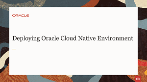](https://youtu.be/M1WyPPxEM1U)
[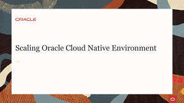](https://youtu.be/AmAOBb-dk-4)

### Installation Hands On Labs
Each hands-on lab provides step-by-step procedures to complete specific tasks in an Oracle-provided free lab environment. Follow the procedures to connect to your Oracle Linux compute instance on Oracle Cloud Infrastructure and complete the labs. Alternatively, you can perform the lab steps on your own Oracle Linux environment.

[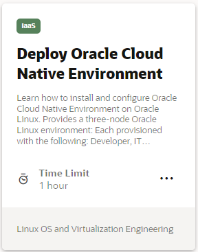](https://luna.oracle.com/lab/d18fe294-efb5-4498-9e7b-d5cc724d8619)
[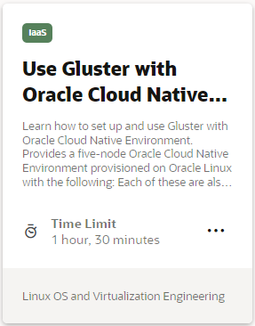](https://luna.oracle.com/lab/5455954d-142c-4801-9f34-5946ad19573d)
[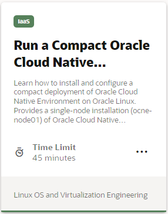](https://luna.oracle.com/lab/c1bf32f7-7809-4355-bf83-d3f46797dd02)
[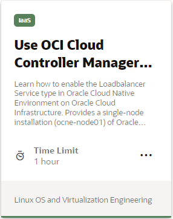](https://luna.oracle.com/lab/5571f277-3eb9-435f-b3b3-fe421fb9747e)
[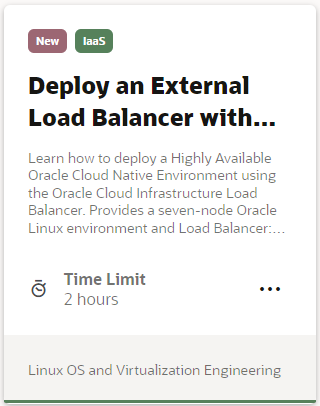](https://luna.oracle.com/lab/be8d99fc-44c3-4062-a3c3-95e982243ccf)
[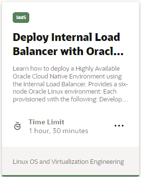](https://luna.oracle.com/lab/15c6f5a7-9fec-4946-bb42-92dd41310fdf)
[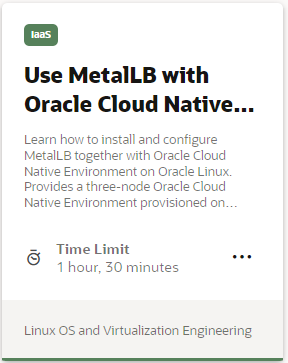](https://luna.oracle.com/lab/d931637d-4e6b-4a46-ba17-810a942c4309)
[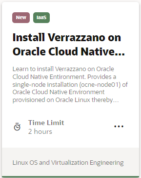](https://luna.oracle.com/lab/8a6bf419-7ef9-4be1-a679-680b03191011)
[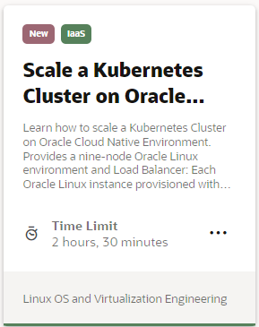](https://luna.oracle.com/lab/6c9e4d88-27e7-43bd-9366-0693fb8e4d3a)

### Installation Tutorial
Each tutorial provides step-by-step procedures to complete specific tasks but does not provide an environment. Perform these tutorial steps on your own Oracle Linux environment.

[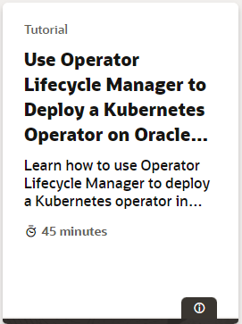](https://docs.oracle.com/en/learn/ocne-olm/)

### Kubernetes Videos
An open-source system for automating the deployment, scaling and management of containerized applications, Kubernetes provides the tools to build a cluster of systems to support the launching of containerized applications. These containers can be deployed across the cluster systems and scaled as needed.

The following videos will introduce you to the Kubernetes cluster technology and its components. They show how a Kubernetes cluster is built, and how container applications in pods are deployed on the cluster nodes.

[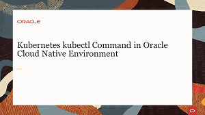](https://youtu.be/0pa4rlFbFdk)
[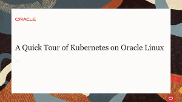](https://youtu.be/syBe1H-qe8U)
[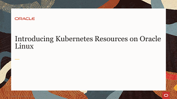](https://youtu.be/e5m3TlvM4y4)

### Kubernetes Hands On Lab
Each hands-on lab provides step-by-step procedures to complete specific tasks in an Oracle-provided free lab environment. Follow the procedures to connect to your Oracle Linux compute instance on Oracle Cloud Infrastructure and complete the labs. Alternatively, you can perform the lab steps on your own Oracle Linux environment.

[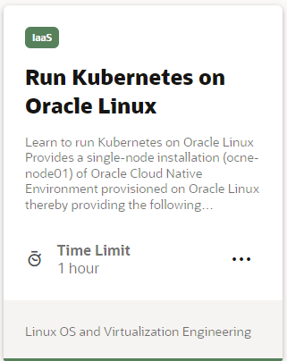](https://luna.oracle.com/lab/01e69515-8cda-4d6e-89af-849f324c4b7f)

### Kata Container Videos
Kata Container software delivers the framework for creating lightweight virtual machines (VMs) that easily plug into container ecosystems. Kata Containers offer similar virtual machine levels of security while maintaining the efficiencies gained from the deployment of traditional containers.

The following videos will introduce you to Kata Containers functionality and demonstrate how Kata Containers are deployed in your Kubernetes cluster.

### Container Videos
Podman provides a way to build, share and run containers conforming to the the Open Containers Initiative (OCI) format.

The following videos will introduce you to Containers, and demonstrate using Podman to deploy and manage container images designed for Kubernetes, Oracle Container Runtime for Docker, and Oracle Linux Cloud Native Environment.

[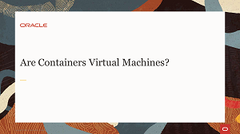](https://youtu.be/AvNDTpmHOMk)

[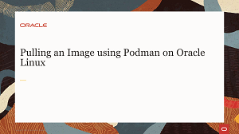](https://youtu.be/QmZE-lFNzk4)

[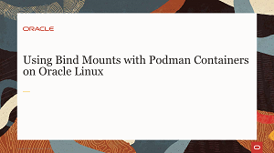](https://youtu.be/Kw5vdNRRaZc)
[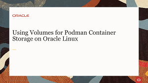](https://youtu.be/qIjTMOfGa_Y)

### Microservices Traffic Management Videos
Operating as a service mesh for managing the interaction and operation of services in a microservices architecture. Istio coordinates communication between services, providing service discovery, load balancing, security, recovery, telemetry, and policy enforcement capabilities.

The following videos will introduce you to the role of Istio in supporting the microservices framework. You will learn about the Istio architecture and its sidecar proxy capabilities implemented in a Kubernetes cluster.

[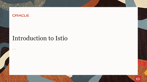](https://youtu.be/yr3rgcR_jwU)

### Istio Hands On Lab
Each hands-on lab provides step-by-step procedures to complete specific tasks in an Oracle-provided free lab environment. Follow the procedures to connect to your Oracle Linux compute instance on Oracle Cloud Infrastructure and complete the labs. Alternatively, you can perform the lab steps on your own Oracle Linux environment.

[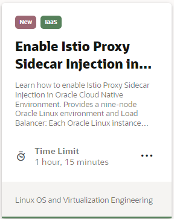](https://luna.oracle.com/lab/6e667326-fd72-4e65-a5b5-8398c5eef960)

---
## Quiz
Test your skills on what you have learned so far with this quiz.   
 
<table>
    <tr>
    <td></td>
    <td><a href="https://apexapps.oracle.com/pls/apex/f?p=ST_QUIZ:200:0::::P200_QUIZ_KEY:DWXQQN7">Oracle Cloud Native Environment Track Quiz</a></td>
  </tr>
</table>    
<b>Note:</b> To access the quiz you will need to create a Single Sign On account if you do not already have one.

---
   
   

---
Oracle is actively investigating new microservices technologies permitting you to do research and development. The following videos describe configurations that leverage these technologies intended for pre-production systems.

#### Helm Videos
Operating as a package manager for Kubernetes, Helm manages the creation of complex, multi-container applications and web services in an existing Oracle Container Services for use with Kubernetes clusters.

The following videos will introduce you to Helm, its components and features, as well as explaining its use of charts, chart repositories and plugins.

[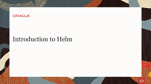](https://youtu.be/mKNqFyub0mU)
[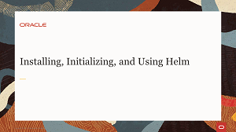](https://youtu.be/zOrBVhxOvMU)

#### Prometheus Video
Operating as an open source monitoring and alerting system. Prometheus uses log collectors for monitoring and performance tuning. Prometheus can gather logs from various metrics and present the data in the form of basic graphs for analysis.

The following video will introduce you to Prometheus, its time-series database and multi-dimensional data model for collecting metrics, as well as describing key steps to installing and running Prometheus.

[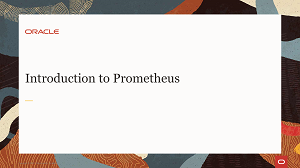](https://youtu.be/E2123yZAJ0c)

#### Grafana Video
Implemented by Dev-Ops teams to collect metrics in their cloud native environments, Grafana operates as an open source analysis and visualization tool for time series data. Using a plugin architecture, it allows for data to be captured across different sources and visualized on dashboards.

The following video will introduce Grafana, cover its installation, and demonstrate its configuration through the browser user interface.

---
## Quiz
Test your skills on your knowledge of the Tech Preview content you have watched with this quiz.   
 
<table>
    <tr>
    <td></td>
    <td><a href="https://apexapps.oracle.com/pls/apex/f?p=ST_QUIZ:200:0::::P200_QUIZ_KEY:31YKJS">Oracle Cloud Native Environment Tech Preview Quiz</a></td>
  </tr>
</table>    
<b>Note:</b> To access the quiz you will need to create a Single Sign On account if you do not already have one.

---

#### [Return to Oracle Linux Training Station](../README.md)
