# Welcome to Oracle Cloud Native Environment Track 

   
<table width="1200">
<colgroup>
   <col width="900">
   <col width="300">
</colgroup>
   <tr>   
      <td>
	 <h3><b>This track contains videos to facilitate your usage of the technologies, software and tools used by Oracle to develop microservices-based applications that can be deployed in environments that support open standards and specifications.</b></h3>
	 
On these pages you will find material such as videos, documents and useful resource links covering areas including the following:

    <ul>
        <li>Container Runtime</li>
	<li>Orchestration and Deployment</li>
	<li>Microservices Traffic Management</li>
        <li>Management Operations</li>
        <li>Monitoring</li>
     </ul>
	  
Information and videos presented here cover Microservices technologies which are components of the Oracle Cloud Native Environment General Availability announcement, as well as additional technologies to help you expand your learning of microservices.

      </td>
      <td rowspan="2" valign="top">
<i>Go straight to our most popular topics. Click these links to jump to the free videos, hands on labs and more:</i>

         <ul>
            <li><a href="#kubernetes-videos">Kubernetes</a></li>
	    <li><a href="#podman-videos">Podman</a></li>
	    <li><a href="#installation-hands-on-labs">Free Installation labs</a></li>
            <li><a href="#quiz">Take the quiz</a></li>
         </ul>
      </td>
   </tr>
   <tr>   
      <td>  </td>
   </tr>
</table>   
   
 

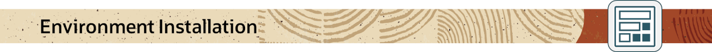

<h2>Videos</h2>
   
The following videos will introduce you to the installation procedure and scaling of the Oracle Cloud Native Environment.

### Release 1.4 and 1.5 Videos

[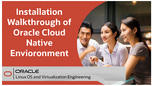](https://youtu.be/IuMKKWdDgc4)
[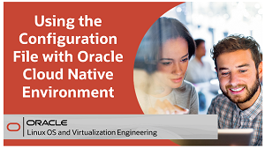](https://youtu.be/pfnfu8B3atI)
[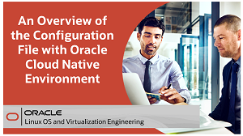](https://youtu.be/n7VhqiiYa1U)

### Release 1.3 Videos

[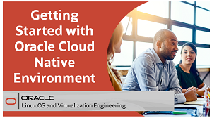](https://youtu.be/agoEHX0M7bk)
[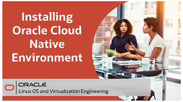](https://youtu.be/bN_SLTGdJJQ)
[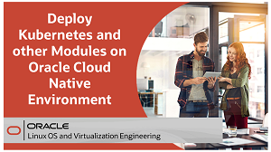](https://youtu.be/_dahVFaasAo)
[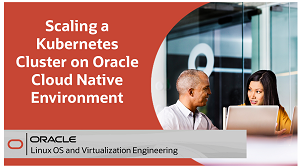](https://youtu.be/aVyqWh048yo)

<h2>Hands On Labs</h2>
Each hands-on lab provides step-by-step procedures to complete specific tasks in an Oracle-provided free lab environment. Follow the procedures to connect to your Oracle Linux compute instance on Oracle Cloud Infrastructure and complete the labs. Alternatively, you can perform the lab steps on your own Oracle Linux environment.

<a href="https://youtu.be/HOB5dhbcAyo">Click here to learn about using the free hands on labs</a>

 

[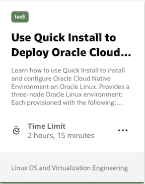](https://luna.oracle.com/lab/42f9b19b-e254-42cf-885d-a80127d9d751)
[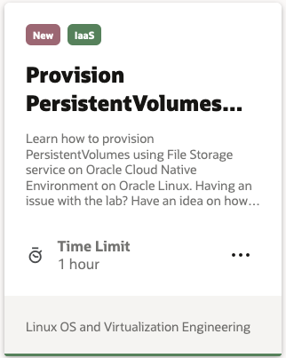](https://luna.oracle.com/lab/5d95fdca-c690-4ebf-8ac0-315ac095ac59)
[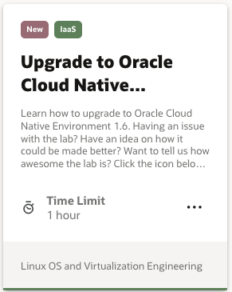](https://luna.oracle.com/lab/fa8fc61b-893c-4507-93a2-711540e9ace7)

<h2>Tutorials</h2>
Each tutorial provides step-by-step procedures to complete specific tasks but does not provide an environment. Perform these tutorial steps on your own Oracle Linux environment.

---
 

<h2>Videos</h2>
An open-source system for automating the deployment, scaling and management of containerized applications, Kubernetes provides the tools to build a cluster of systems to support the launching of containerized applications. These containers can be deployed across the cluster systems and scaled as needed.

The following videos will introduce you to the Kubernetes cluster technology and its components. They show how a Kubernetes cluster is built, and how container applications in pods are deployed on the cluster nodes.

[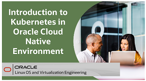](https://youtu.be/q2j7jjuBbiM)
[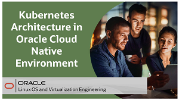](https://youtu.be/H2rAeWkxp1Y)
[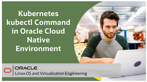](https://youtu.be/0pa4rlFbFdk)
[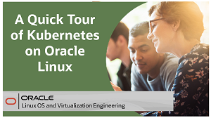](https://youtu.be/syBe1H-qe8U)
[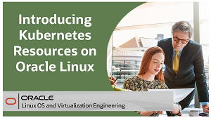](https://youtu.be/e5m3TlvM4y4)

<h2>Hands On Labs</h2>
Each hands-on lab provides step-by-step procedures to complete specific tasks in an Oracle-provided free lab environment. Follow the procedures to connect to your Oracle Linux compute instance on Oracle Cloud Infrastructure and complete the labs. Alternatively, you can perform the lab steps on your own Oracle Linux environment.

<a href="https://youtu.be/HOB5dhbcAyo">Click here to learn about using the free hands on labs</a>

 

[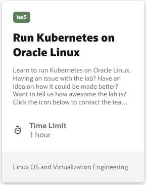](https://luna.oracle.com/lab/01e69515-8cda-4d6e-89af-849f324c4b7f)
[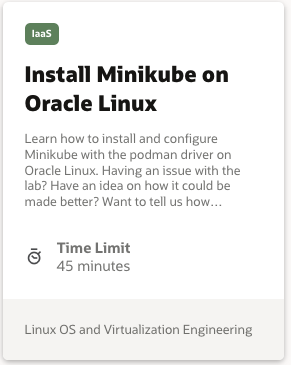](https://luna.oracle.com/lab/8b2f7860-3204-4cd3-8d55-3f6de9ca03c2)
[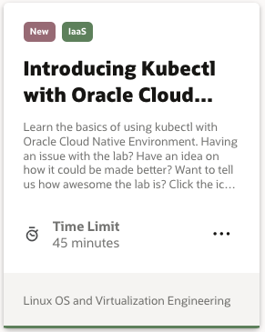](https://luna.oracle.com/lab/6c65a513-b161-47d2-b45c-92ca02e38dc0)

---
 

<h2>Videos</h2>

Podman provides a lightweight utility to run and manage Open Container Initiative (OCI) compatible containers. A Podman deployment can re-use existing container images that are designed for Kubernetes, Oracle Container Runtime for Docker, and Oracle Cloud Native Environment.

The following videos will show how you can use Podman to pull container images and work with registries and storage. How you can manage container images, run containers and use Dockerfiles with Podman.  

<table width="500">
      <tr>   
         <td valign="top"><b>Use this link to get to all the available Podman videos:</b>
            <ul>
               <li><a href="https://oracle-samples.github.io/oltrain/OL/virt/virt.html#container-videos">Podman videos</a></li>
            </ul>
         </td>
      </tr>
</table>  
    
   
<h2>Hands On Labs</h2>

These hands-on lab provides step-by-step procedures to complete specific Podman tasks in an Oracle-provided free lab environment. Alternatively, you can perform the lab steps on your own Oracle Linux environment.

<table width="500">
      <tr>   
         <td valign="top"><b>Use this link to go to the full list of free Podman labs:</b>
            <ul>
               <li><a href="https://oracle-samples.github.io/oltrain/OL/virt/virt.html#container-hands-on-labs">Podman labs</a></li>
            </ul>
         </td>
      </tr>
</table>  
 

---
 

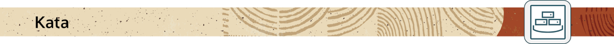

<h2>Videos</h2>
Kata Container software delivers the framework for creating lightweight virtual machines (VMs) that easily plug into container ecosystems. Kata Containers offer similar virtual machine levels of security while maintaining the efficiencies gained from the deployment of traditional containers.

The following video will introduce you to Kata Containers functionality and demonstrate how Kata Containers are deployed in your Kubernetes cluster.

[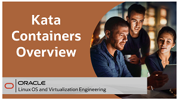](https://youtu.be/0P2kQMCssm4)

---
 

<h2>Videos</h2>
Operating as a service mesh for managing the interaction and operation of services in a microservices architecture. Istio coordinates communication between services, providing service discovery, load balancing, security, recovery, telemetry, and policy enforcement capabilities.

The following videos will introduce you to the role of Istio in supporting the microservices framework. You will learn about the Istio architecture and its sidecar proxy capabilities implemented in a Kubernetes cluster.

[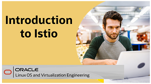](https://youtu.be/yr3rgcR_jwU)
[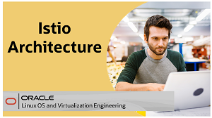](https://youtu.be/67j5pKaezAk)
[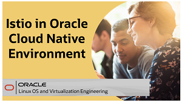](https://youtu.be/0W5fQnlJppw)
[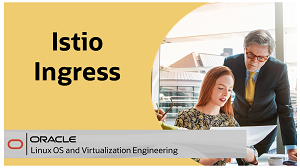](https://youtu.be/Fkl7Zzn45X4)

[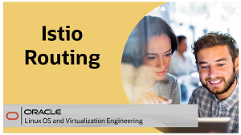](https://youtu.be/HDagk09TayQ)

<h2>Hands On Labs</h2>
Each hands-on lab provides step-by-step procedures to complete specific tasks in an Oracle-provided free lab environment. Follow the procedures to connect to your Oracle Linux compute instance on Oracle Cloud Infrastructure and complete the labs. Alternatively, you can perform the lab steps on your own Oracle Linux environment.

<a href="https://youtu.be/HOB5dhbcAyo">Click here to learn about using the free hands on labs</a>

 

---
## Quiz
Test your skills on what you have learned so far with this quiz.   
 
<table>
    <tr>
    <td></td>
    <td><a href="https://apexapps.oracle.com/pls/apex/f?p=ST_QUIZ:200:0::::P200_QUIZ_KEY:DWXQQN7">Oracle Cloud Native Environment Track Quiz</a></td>
  </tr>
</table>    
<b>Note:</b> To access the quiz you will need to create a Single Sign On account if you do not already have one.

---

### Resources

Following page provides additional product information:

- [Oracle Cloud Native Environment Documentation](https://docs.oracle.com/en/operating-systems/olcne/)
- [Oracle Cloud Native Environment Training YouTube Playlist](https://www.youtube.com/playlist?list=PLKCk3OyNwIzuwyOFQFhl_UyUoJPoseTN-)

---

#### [Return to Oracle Linux Training Station](../README.md)
