## Administration Videos
These short videos go through some common administration tasks that you can perform on Oracle Linux. You can learn step-by-step how to configure the system date and time, automate tasks, dynamically load and unload kernel modules, configure users and groups, and explore the proc and sysfs file systems to view and configure system hardware and system processes. These tasks are applicable for on-premises systems or Oracle Cloud Infrastructure instances.

[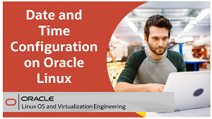](https://youtu.be/q8VlYiF5sx8)
[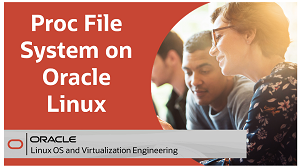](https://youtu.be/1F51ZHAVfAk)
[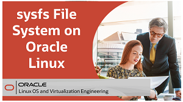](https://youtu.be/j9x2cuOE5_Y)

[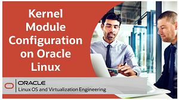](https://youtu.be/AeW42ZyzHrQ)

[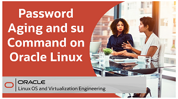](https://youtu.be/WrcnDpj3axQ)
[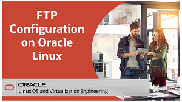](https://youtu.be/xpBBUPLEkZg)

[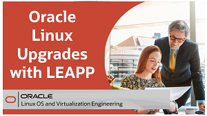](https://youtu.be/kxeBILa3YNc)
[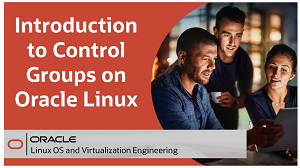](https://youtu.be/AiYK0VBW7e4)
[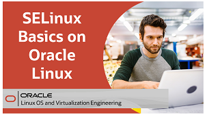](https://youtu.be/meKjLOxEu_o)
[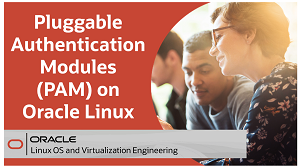](https://youtu.be/KRGC2lElVC8)
[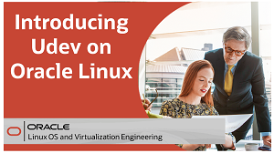](https://youtu.be/y3q8HAMTPDc)

## Administration Hands On Labs
Each hands-on lab provides step-by-step procedures to complete specific tasks in an Oracle-provided free lab environment. Follow the procedures to connect to your Oracle Linux compute instance on Oracle Cloud Infrastructure and complete the labs. Alternatively, you can perform the lab steps on your own Oracle Linux environment.

<a href="https://youtu.be/HOB5dhbcAyo">Click here to learn about using the free hands on labs</a>

 

[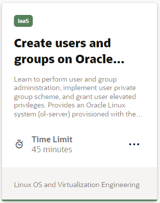](https://luna.oracle.com/lab/fb0e97c0-4522-422f-8be3-dd6f70a7b96e)
[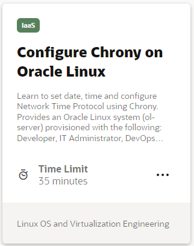](https://luna.oracle.com/lab/4946609e-41e4-4d26-8501-da948bb299ba)
[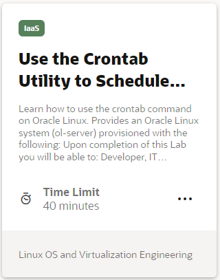](https://luna.oracle.com/lab/d857ff70-1799-472e-b413-32ea7e356470)
[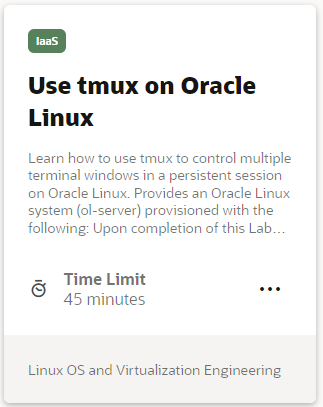](https://luna.oracle.com/lab/4dda7413-1a31-47bf-96c1-8fa6c306dc6b)
[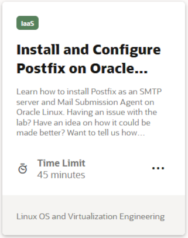](https://luna.oracle.com/lab/4255c51c-4f52-45f3-a3e8-125b8cf1b40b)
[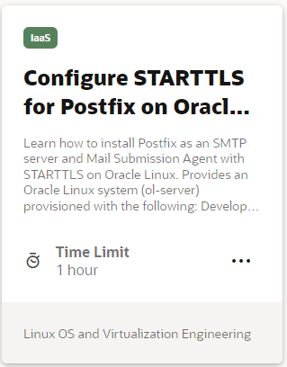](https://luna.oracle.com/lab/6c0d44b2-1247-4780-a1ae-09f283812ef8)
[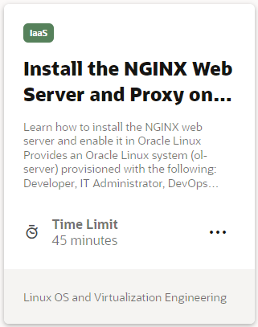](https://luna.oracle.com/lab/54fa9d88-4243-4b4f-bae2-d52ec8cfb688)
[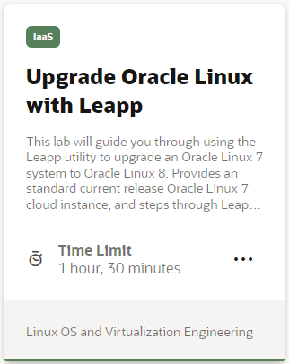](https://luna.oracle.com/lab/908d0e5b-4444-400a-87a7-2a9ec8c27550)
[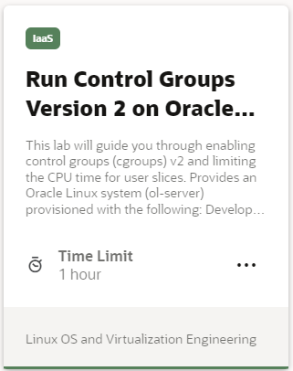](https://luna.oracle.com/lab/14d89b6d-627b-4f1f-b859-4761e3ed352c)

[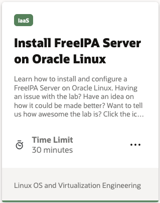](https://luna.oracle.com/lab/19bfac85-6c1e-4775-8fc3-6f55022a8e47)
[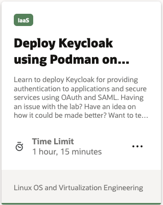](https://luna.oracle.com/lab/752793ff-9f74-4bb0-b848-90c5bcae4388)

---

   
   
Test your skills on what you have learned about administration of Oracle Linux with this quiz.

<table>
    <tr>
    <td></td>
    <td><a href="https://apexapps.oracle.com/pls/apex/f?p=ST_QUIZ:200:0::::P200_QUIZ_KEY:IJY13J">Oracle Linux Administration Quiz</a></td>
  </tr>
</table>
<b>Note:</b> To access the quiz you will need to create a Single Sign On account if you do not already have one.

---

### Resources

Following page provides additional product information:

- [Oracle Linux Documentation Home Page](https://docs.oracle.com/en/operating-systems/oracle-linux/)
- [Oracle Linux Training YouTube Playlist](https://www.youtube.com/playlist?list=PLKCk3OyNwIztOLwiTOF0HOV5aiTjGNpLl)

---

#### [Return to Oracle Linux Track](../ol.md)

#### [Return to Oracle Linux Training Station](../../README.md)
