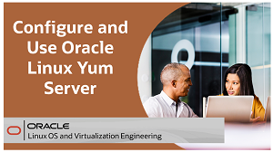

## Oracle Linux How-To Videos
These videos are intended as quick references or short procedural sequences.

---

### Resources

Following page provides additional product information:

- [Oracle Linux Documentation Home Page](https://docs.oracle.com/en/operating-systems/oracle-linux/)
- [Oracle Linux Training YouTube Playlist](https://www.youtube.com/playlist?list=PLKCk3OyNwIztOLwiTOF0HOV5aiTjGNpLl)

---

#### [Return to Oracle Linux Track](../ol.md)

#### [Return to Oracle Linux Training Station](../../README.md)
