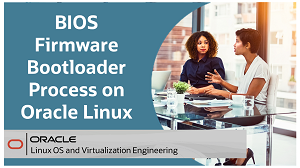
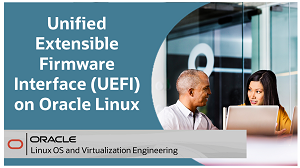
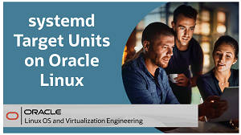
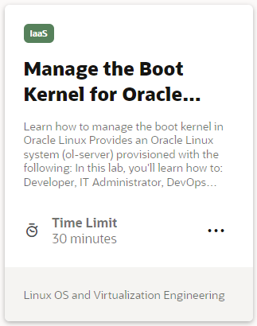
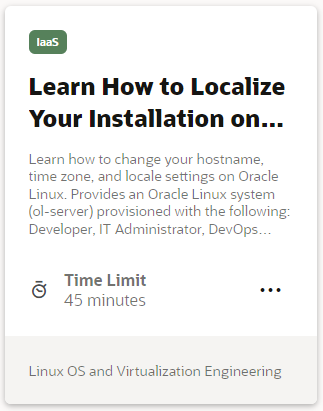
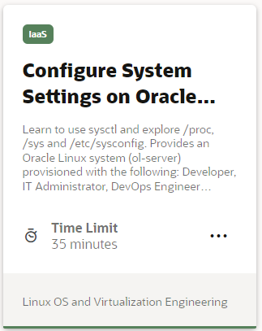
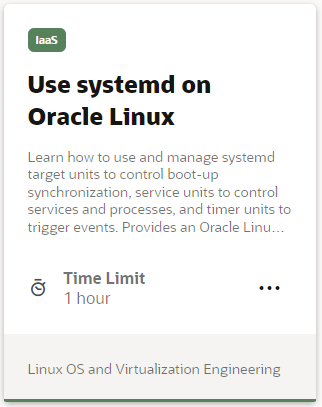
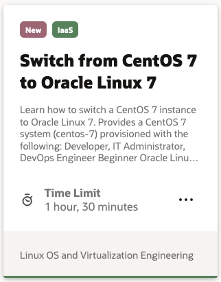
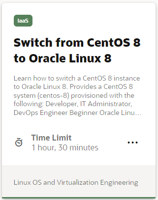

## Installation and Boot Process Videos
These videos focus on the installation and boot process. You can learn step-by-step how to complete an Oracle Linux 8 installation for on-premises deployment and how to create an Oracle Linux 8 instance on Oracle Cloud Infrastructure. You can also learn about the boot process and how to configure different services to start at boot time.

## Installation and Boot Process Hands On Labs
Each hands-on lab provides step-by-step procedures to complete specific tasks in an Oracle-provided free lab environment. Follow the procedures to connect to your Oracle Linux compute instance on Oracle Cloud Infrastructure and complete the labs. Alternatively, you can perform the lab steps on your own Oracle Linux environment.

---

   
   
Test your skills on what you have learned about installation and the boot process with this quiz.   
 
<table>
    <tr>
    <td></td>
    <td><a href="https://apexapps.oracle.com/pls/apex/f?p=ST_QUIZ:200:0::::P200_QUIZ_KEY:DLCZA6M">Oracle Linux Installation Quiz</a></td>
  </tr>
</table>    
<b>Note:</b> To access the quiz you will need to create a Single Sign On account if you do not already have one.

---
#### [Return to Oracle Linux Track](../ol.md)

#### [Return to Oracle Linux Training Station](../../README.md)
