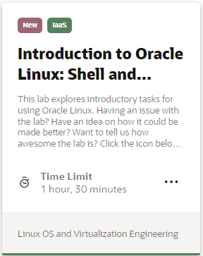

## Introduction to Oracle Linux Videos
On this track you will learn technologies and components included in Oracle Linux and common tools and features of Linux.

## Introduction to Oracle Linux Hands-on Lab
This hands-on lab provides step-by-step procedures to complete specific tasks on your own Oracle Linux environment.

<a href="https://youtu.be/HOB5dhbcAyo">Click here to learn about using the free hands on labs</a>

   

---

   
   
Test your skills on what you have learned so far with this quiz.   
 
<table>
    <tr>
    <td></td>
    <td><a href="https://apexapps.oracle.com/pls/apex/f?p=ST_QUIZ:200:0::::P200_QUIZ_KEY:IJY139">Introduction to Oracle Linux Quiz</a></td>
  </tr>
</table>    
<b>Note:</b> To access the quiz you will need to create a Single Sign On account if you do not already have one.

---

### Resources

Following page provides additional product information:

- [Oracle Linux Documentation Home Page](https://docs.oracle.com/en/operating-systems/oracle-linux/)
- [Introduction to Oracle Linux Training YouTube Playlist](https://www.youtube.com/playlist?list=PLKCk3OyNwIzvZR0-OoTtScm2NNo68gWtq)

---

#### [Return to Oracle Linux Track](../ol.md)

#### [Return to Oracle Linux Training Station](../../README.md)
