## Introduction to Oracle Linux Videos
On this track you will learn technologies and components included in Oracle Linux and common tools and features of Linux.

[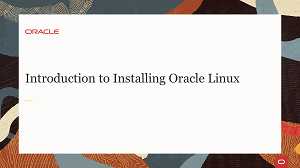](https://youtu.be/dvvP4wpsAQI)

[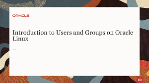](https://youtu.be/rjY_Z9diSwE)

[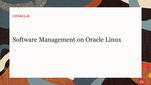](https://youtu.be/QiiVUyUxIc8)
[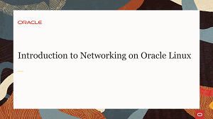](https://youtu.be/V6HT5lXo4g0)
[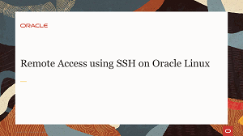](https://youtu.be/ednoES-3JfU)
[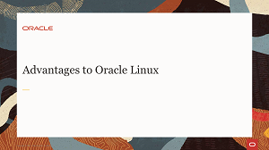](https://youtu.be/xuLdJ3cQrXo)
[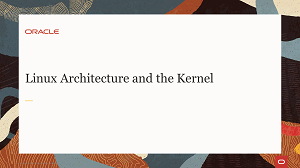](https://youtu.be/a0zXGhzPRp8)
[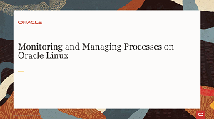](https://youtu.be/wMaWGV2yqtY)
[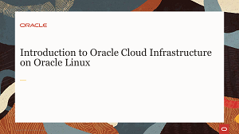](https://youtu.be/APTzx_7azmA)
[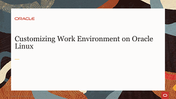](https://youtu.be/kdpfqiAp8BA)
[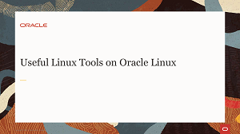](https://youtu.be/ZXO4hqoO52o)
[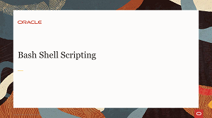](https://youtu.be/d6ktKrOOkZs)

## Introduction to Oracle Linux Tutorial
This tutorial provides step-by-step procedures to complete specific tasks on your own Oracle Linux environment.

[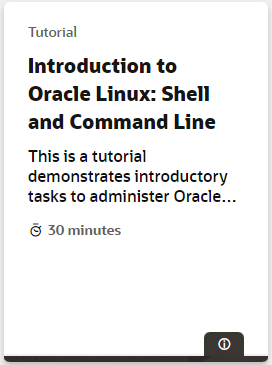](https://docs.oracle.com/en/learn/shell-commands-intro-to-oracle-linux/index.html)

#### [Return to Oracle Linux Track](../ol.md)

#### [Return to Oracle Linux Training Station](../../README.md)
