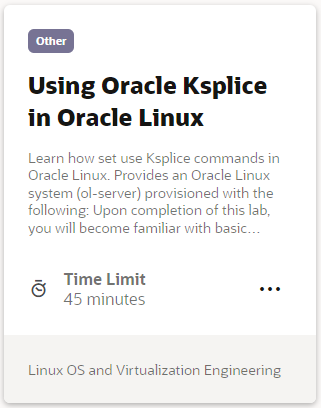

## Oracle Ksplice Videos
Oracle Ksplice allows you to install the latest kernel and key user-space security and bug fix updates while the system is running. Learn to install, configure and use Oracle Ksplice to provide rebootless kernel and critical user-space updates.

## Oracle Ksplice Hands On Lab
Each hands-on lab provides step-by-step procedures to complete specific tasks in an Oracle-provided free lab environment. Follow the procedures to connect to your Oracle Linux compute instance on Oracle Cloud Infrastructure and complete the labs. Alternatively, you can perform the lab steps on your own Oracle Linux environment.

#### [Return to Oracle Linux Track](../ol.md)

#### [Return to Oracle Linux Training Station](../../README.md)
