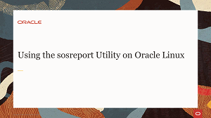
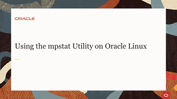
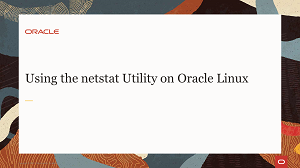
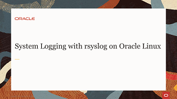
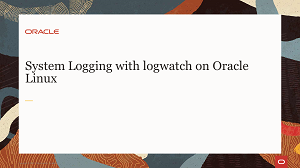
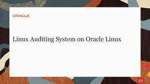
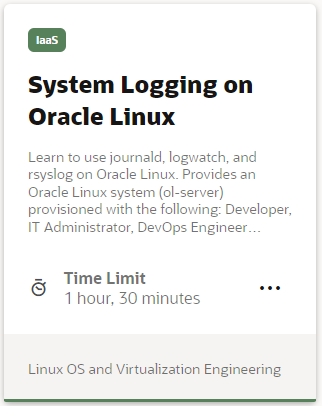
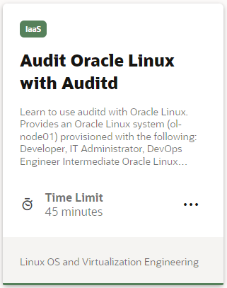

## Monitoring and Logging Videos
These videos go through typical monitoring and logging tasks performed on a Linux system. Learn how to monitor system performance and review system logs on Oracle Linux.

## Monitoring and Logging Hands On Labs
Each hands-on lab provides step-by-step procedures to complete specific tasks in an Oracle-provided free lab environment. Follow the procedures to connect to your Oracle Linux compute instance on Oracle Cloud Infrastructure and complete the labs. Alternatively, you can perform the lab steps on your own Oracle Linux environment.

#### [Return to Oracle Linux Track](../ol.md)

#### [Return to Oracle Linux Training Station](../../README.md)
