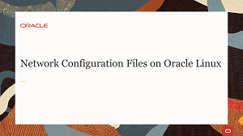
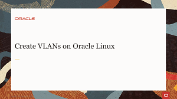
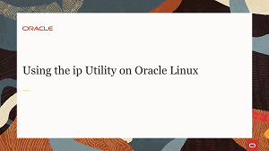
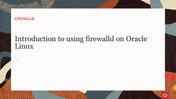
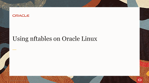

## Networking Videos
These videos go through the configuration files, firewalls, and command line utilities to get a Linux system online. Learn how to connect Oracle Linux to the network. Being able to configure networks is an essential skill to access programs, storage and data on remote systems.

## Networking Hands On Labs
Each hands-on lab provides step-by-step procedures to complete specific tasks in an Oracle-provided free lab environment. Follow the procedures to connect to your Oracle Linux compute instance on Oracle Cloud Infrastructure and complete the labs. Alternatively, you can perform the lab steps on your own Oracle Linux environment.

#### [Return to Oracle Linux Track](../ol.md)

#### [Return to Oracle Linux Training Station](../../README.md)
