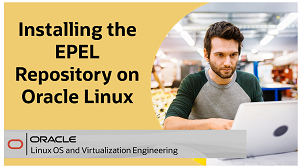
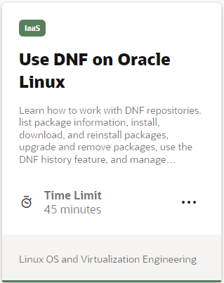
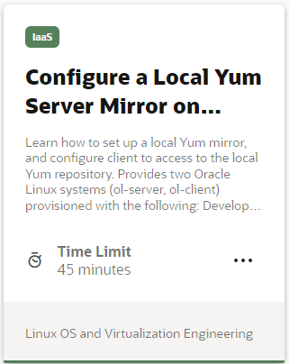

## Package Management Videos
Software package management is an essential skill needed to keep your Oracle Linux system up to date with the latest software enhancements, bug fixes, and security patches. Oracle Linux 8 introduced DNF, which replaces YUM, and in this video series, we cover how to use DNF, install the Oracle UEK kernel and how to add repositories.

## Package Management Hands On Labs
Each hands-on lab provides step-by-step procedures to complete specific tasks in an Oracle-provided free lab environment. Follow the procedures to connect to your Oracle Linux compute instance on Oracle Cloud Infrastructure and complete the labs. Alternatively, you can perform the lab steps on your own Oracle Linux environment.

---

   
  
Test your skills on what you have learned about package management with Oracle Linux with this quiz.   
 
<table>
    <tr>
    <td></td>
    <td><a href="https://apexapps.oracle.com/pls/apex/f?p=ST_QUIZ:200:0::::P200_QUIZ_KEY:2EE70X">Oracle Linux Package Management Quiz</a></td>
  </tr>
</table>    
<b>Note:</b> To access the quiz you will need to create a Single Sign On account if you do not already have one.

---
#### [Return to Oracle Linux Track](../ol.md)

#### [Return to Oracle Linux Training Station](../../README.md)
