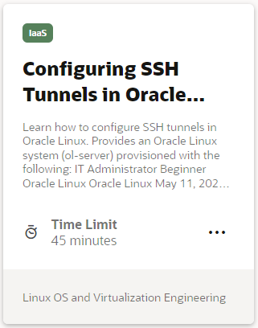

## Remote Management Videos
When working with Oracle Linux, the environment you are accessing is not always physically accessible. In those cases, you need to know how to administer your environment remotely. Watch these short videos on how to establish secure connections to remote Oracle Linux 8 systems. With secure connections, all traffic transmitted over the wire is encrypted and protected from password sniffing attacks and other outside monitoring.

## Remote Management Hands On Lab
Each hands-on lab provides step-by-step procedures to complete specific tasks in an Oracle-provided free lab environment. Follow the procedures to connect to your Oracle Linux compute instance on Oracle Cloud Infrastructure and complete the labs. Alternatively, you can perform the lab steps on your own Oracle Linux environment.

<a href="https://youtu.be/HOB5dhbcAyo">Click here to learn about using the free hands on labs</a>

 

---

   
  
Test your skills on what you have learned about remote management of Oracle Linux with this quiz.   
 
<table>
    <tr>
    <td></td>
    <td><a href="https://apexapps.oracle.com/pls/apex/f?p=ST_QUIZ:200:0::::P200_QUIZ_KEY:BG99CGZ">Oracle Linux Remote Management Quiz</a></td>
  </tr>
</table>    
<b>Note:</b> To access the quiz you will need to create a Single Sign On account if you do not already have one.

---
### Resources

Following page provides additional product information:

- [Oracle Linux Documentation Home Page](https://docs.oracle.com/en/operating-systems/oracle-linux/)
- [Oracle Linux Training YouTube Playlist](https://www.youtube.com/playlist?list=PLKCk3OyNwIztOLwiTOF0HOV5aiTjGNpLl)

---

#### [Return to Oracle Linux Track](../ol.md)

#### [Return to Oracle Linux Training Station](../../README.md)
