## Storage Management Videos
Whether manually partitioning your primary disk, adding additional disks for storage, or creating shared storage, working with disks is a skill all Linux Administrators should know. These videos will get you started on using fdisk, formatting, filesystems, and disk encryption.

[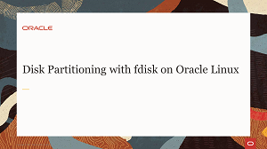](https://youtu.be/3edFvAXe4Hs)

[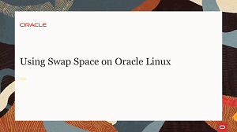](https://youtu.be/rv6iXD8Iod0)
[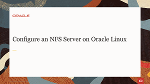](https://youtu.be/fnVoVzB8Px0)
[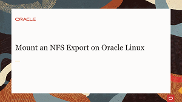](https://youtu.be/YFeaOEgFrto)

[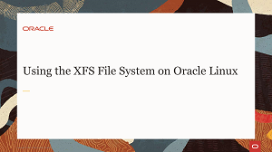](https://youtu.be/OUW1cbR-WuA)
[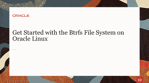](https://youtu.be/hu3xX3o3ciA)
[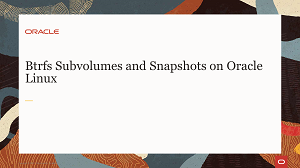](https://youtu.be/xH305gNQvJ8)
[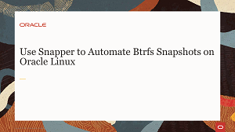](https://youtu.be/U3Ur9x_gZSg)
[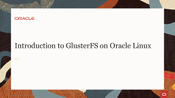](https://youtu.be/N7BeDUOcKg4)
[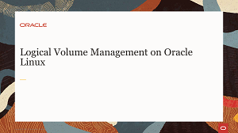](https://youtu.be/2ebupdOpOn8)

## Storage Management Hands On Labs
Each hands-on lab provides step-by-step procedures to complete specific tasks in an Oracle-provided free lab environment. Follow the procedures to connect to your Oracle Linux compute instance on Oracle Cloud Infrastructure and complete the labs. Alternatively, you can perform the lab steps on your own Oracle Linux environment.

[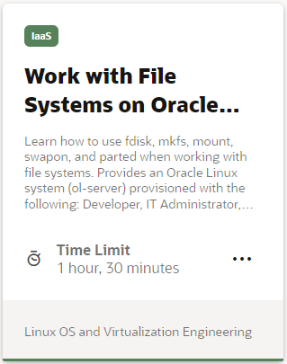](https://luna.oracle.com/lab/bbfe7177-f27a-42f5-97cf-95b7027efa26)
[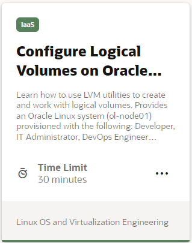](https://luna.oracle.com/lab/545675ec-9c52-42a5-b823-a7efb1ed237c)
[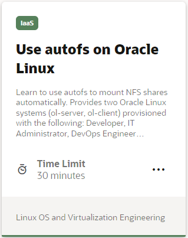](https://luna.oracle.com/lab/5847ea10-bead-4dda-be13-72b55551f6a2)
[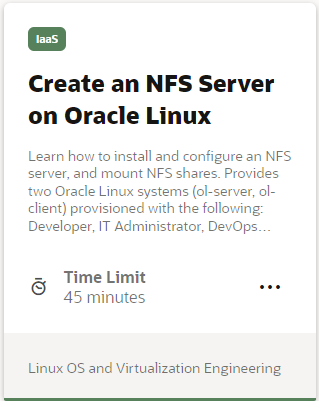](https://luna.oracle.com/lab/3e7b391f-db29-405d-85bc-b70ad5753dd4)
[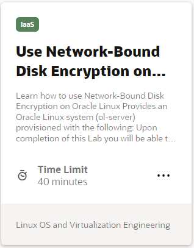](https://luna.oracle.com/lab/e348bfed-8e08-4b12-8114-74e87eb12497)
[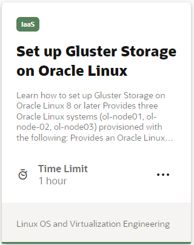](https://luna.oracle.com/lab/4de49ca0-6b00-4c69-95a7-a60a4b21ab78)
[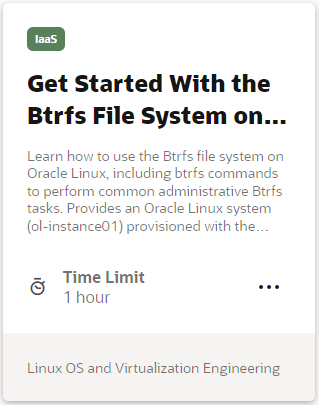](https://luna.oracle.com/lab/03f1fb2b-d4ef-4d1e-8a12-793cb3e3ffd8)
[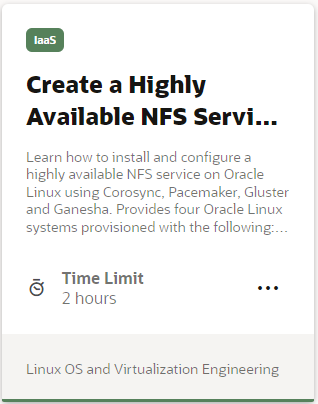](https://luna.oracle.com/lab/2bf5d9a2-7afc-4286-97ef-386427e3ebea)
[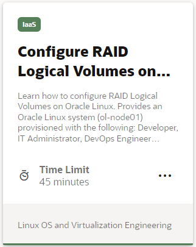](https://luna.oracle.com/lab/2edede28-75f0-4046-8567-4cfd1596f931)
[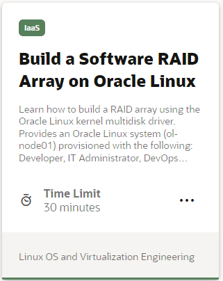](https://luna.oracle.com/lab/2c5aab94-cacb-4978-b0c9-aca5c953f6e4)
[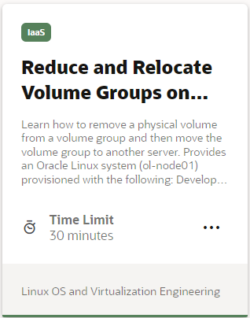](https://luna.oracle.com/lab/ee495d1a-4e00-4d77-9719-2f27591d1ecd)
[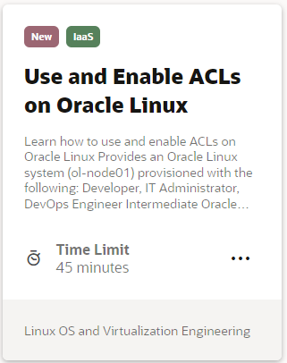](https://luna.oracle.com/lab/7a272852-6042-47e3-b25f-eb681c733e66)
[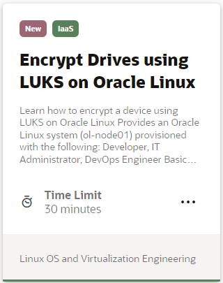](https://luna.oracle.com/lab/9c62956d-153b-4e93-84b0-0b2759f7e4bb)

---

   
  
Test your skills on what you have learned about storage management on Oracle Linux with this quiz.   
 
<table>
    <tr>
    <td></td>
    <td><a href="https://apexapps.oracle.com/pls/apex/f?p=ST_QUIZ:200:0::::P200_QUIZ_KEY:CPXRPS0">Oracle Linux Storage Management Quiz</a></td>
  </tr>
</table>    
<b>Note:</b> To access the quiz you will need to create a Single Sign On account if you do not already have one.

---
#### [Return to Oracle Linux Track](../ol.md)

#### [Return to Oracle Linux Training Station](../../README.md)
