### KVM Management Videos

[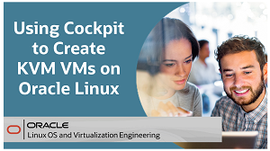](https://youtu.be/daHQeCY13s8)
[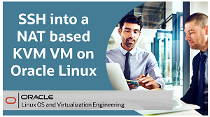](https://youtu.be/2MEqDxOeuDw)

[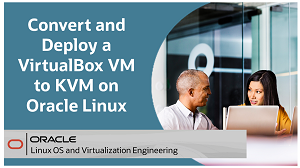](https://youtu.be/7gZLiTa3150)
[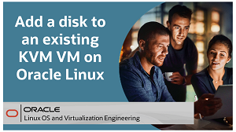](https://youtu.be/B3h_DWOMwrk)

### KVM Hands On Lab

<a href="https://youtu.be/HOB5dhbcAyo">Click here to learn about using the free hands on labs</a>

<a href="https://youtu.be/HOB5dhbcAyo">
   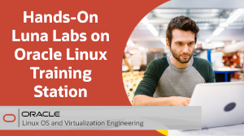
   </a>
 

[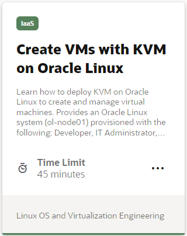](https://luna.oracle.com/lab/1671b073-895c-4800-bd60-cfe1f445074c)
   
   

   
      
Test your skills on what you have learned about KVM virtualization on Oracle Linux with this quiz.   
 
<table>
    <tr>
    <td></td>
    <td><a href="https://apexapps.oracle.com/pls/apex/f?p=ST_QUIZ:200:0::::P200_QUIZ_KEY:CPXRPS1">Oracle Linux KVM Quiz</a></td>
  </tr>
</table>    
<b>Note:</b> To access the quiz you will need to create a Single Sign On account if you do not already have one.
 
 
 

--- 

### Container Videos

[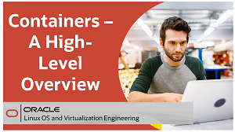](https://youtu.be/V9sOZHfuvVM)
[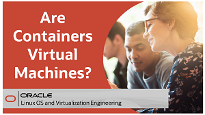](https://youtu.be/AvNDTpmHOMk)

[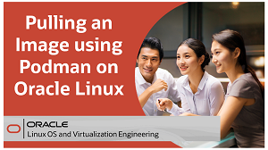](https://youtu.be/QmZE-lFNzk4)
[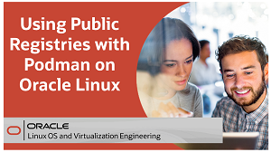](https://youtu.be/q57hNilpakk)

[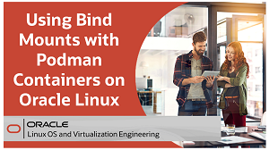](https://youtu.be/Kw5vdNRRaZc)
[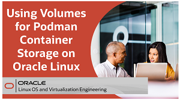](https://youtu.be/qIjTMOfGa_Y)

[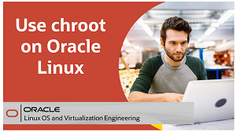](https://youtu.be/dxzwxvn621w)

### Container Hands On Labs

<a href="https://youtu.be/HOB5dhbcAyo">Click here to learn about using the free hands on labs</a>

 

[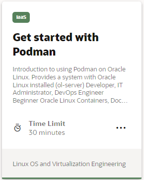](https://luna.oracle.com/lab/4fa11b26-6c31-4595-ac00-b6c6af97f417)
[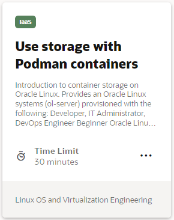](https://luna.oracle.com/lab/0dde3b49-0b91-423e-a126-5e718e05ca64)
[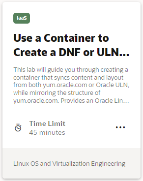](https://luna.oracle.com/lab/42ce804b-ce7c-4fc0-9baf-aaccc4d80495)
[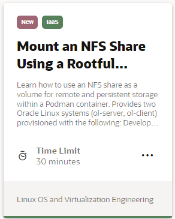](https://luna.oracle.com/lab/556e1401-568f-447e-8c0b-c94a86b1114f)
[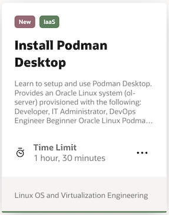](https://luna.oracle.com/lab/55225d03-4fdb-42dd-bb3c-0382cb918963)
[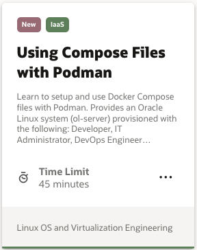](https://luna.oracle.com/lab/0e800b97-2c1b-43a8-b0f0-003f1543d2ba)
[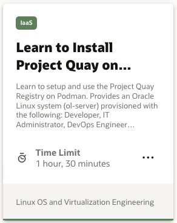](https://luna.oracle.com/lab/e3f488a9-20a8-49d8-ae08-818f8730568c)
[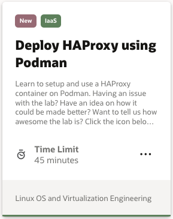](https://luna.oracle.com/lab/a9eb9ff9-b56d-4ddc-9283-b72467d78128)
[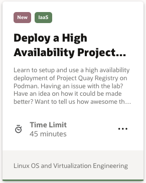](https://luna.oracle.com/lab/a63c2548-c459-457f-b3d1-123c99d90d89)

### Container Tutorial

[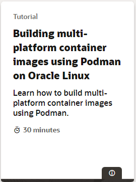](https://docs.oracle.com/en/learn/oracle-linux-platform-images/index.html)
   
   

   
  
Test your skills on what you have learned about working with containers on Oracle Linux with this quiz.   
 
<table>
    <tr>
    <td></td>
    <td><a href="https://apexapps.oracle.com/pls/apex/f?p=ST_QUIZ:200:0::::P200_QUIZ_KEY:CS8UESN">Oracle Linux Containers Quiz</a></td>
  </tr>
</table>    
<b>Note:</b> To access the quiz you will need to create a Single Sign On account if you do not already have one.
 
 
 

---

### Kubernetes Videos

An open-source system for automating the deployment, scaling and management of containerized applications, Kubernetes provides the tools to build a cluster of systems to support the launching of containerized applications. These containers can be deployed across the cluster systems and scaled as needed.

<table width="500">
      <tr>   
         <td valign="top"><b>Use this link to get to all the available Kubernetes videos:</b>
            <ul>
               <li><a href="../../OCNE/ocne.md#kubernetes-videos">Kubernetes videos</a></li>
            </ul>
         </td>
      </tr>
</table>  
    
### Kubernetes Hands On Labs

<table width="500">
      <tr>   
         <td valign="top"><b>Use this link to go to the full list of free Kubernetes labs:</b>
            <ul>
               <li><a href="../../OCNE/ocne.md#kubernetes-hands-on-labs">Kubernetes labs</a></li>
            </ul>
         </td>
      </tr>
</table>  
 

---

   
  
Test your skills on what you have learned about Kubernetes on Oracle Linux with this quiz.   
 
<table>
    <tr>
    <td></td>
    <td><a href="https://apexapps.oracle.com/pls/apex/f?p=ST_QUIZ:200:0::::P200_QUIZ_KEY:BPJX2YO">Oracle Linux Kubernetes Quiz</a></td>
  </tr>
</table>    
<b>Note:</b> To access the quiz you will need to create a Single Sign On account if you do not already have one.

---
### Resources

Following page provides additional product information:

- [Oracle Linux Documentation Home Page](https://docs.oracle.com/en/operating-systems/oracle-linux/)
- [Oracle Linux Training YouTube Playlist](https://www.youtube.com/playlist?list=PLKCk3OyNwIztOLwiTOF0HOV5aiTjGNpLl)

---

#### [Return to Oracle Linux Track](../ol.md)

#### [Return to Oracle Linux Training Station](../../README.md)
