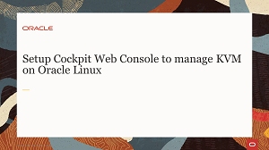
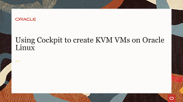
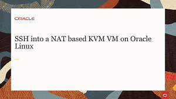
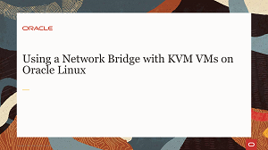
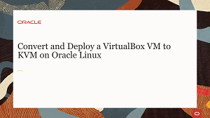
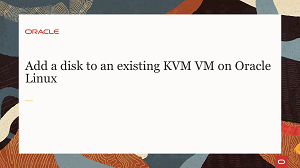
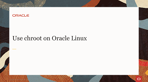
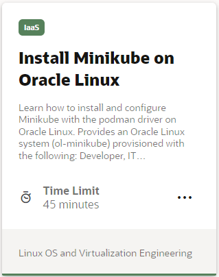

### KVM Management Videos

### KVM Hands On Lab

---

   
      
Test your skills on what you have learned about KVM virtualization on Oracle Linux with this quiz.   
 
<table>
    <tr>
    <td></td>
    <td><a href="https://apexapps.oracle.com/pls/apex/f?p=ST_QUIZ:200:0::::P200_QUIZ_KEY:CPXRPS1">Oracle Linux KVM Quiz</a></td>
  </tr>
</table>    
<b>Note:</b> To access the quiz you will need to create a Single Sign On account if you do not already have one.
 
 

--- 

### Container Videos

### Container Hands On Labs

### Container Tutorial

---

   
  
Test your skills on what you have learned about working with containers on Oracle Linux with this quiz.   
 
<table>
    <tr>
    <td></td>
    <td><a href="https://apexapps.oracle.com/pls/apex/f?p=ST_QUIZ:200:0::::P200_QUIZ_KEY:CS8UESN">Oracle Linux Containers Quiz</a></td>
  </tr>
</table>    
<b>Note:</b> To access the quiz you will need to create a Single Sign On account if you do not already have one.
 
 

---

### Kubernetes Videos

### Kubernetes Hands On Labs

---

   
  
Test your skills on what you have learned about Kubernetes on Oracle Linux with this quiz.   
 
<table>
    <tr>
    <td></td>
    <td><a href="https://apexapps.oracle.com/pls/apex/f?p=ST_QUIZ:200:0::::P200_QUIZ_KEY:BPJX2YO">Oracle Linux Kubernetes Quiz</a></td>
  </tr>
</table>    
<b>Note:</b> To access the quiz you will need to create a Single Sign On account if you do not already have one.

---
#### [Return to Oracle Linux Track](../ol.md)

#### [Return to Oracle Linux Training Station](../../README.md)
