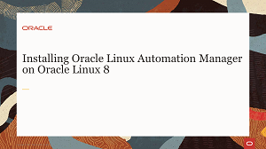
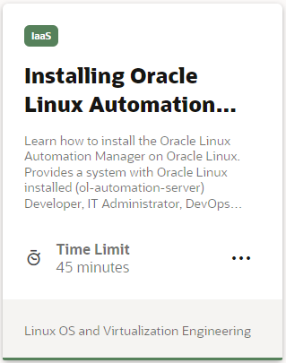
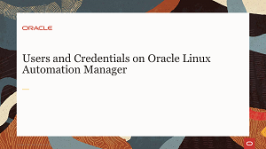
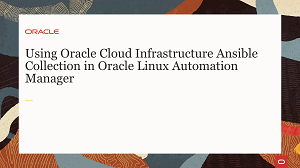
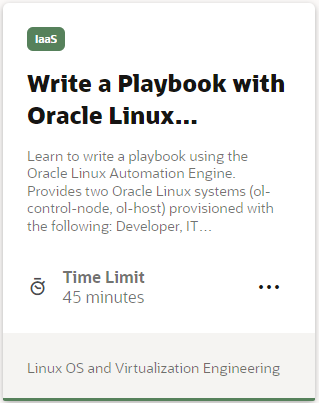
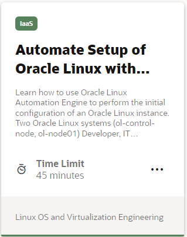
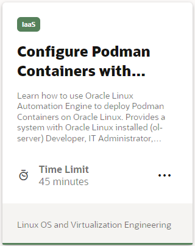
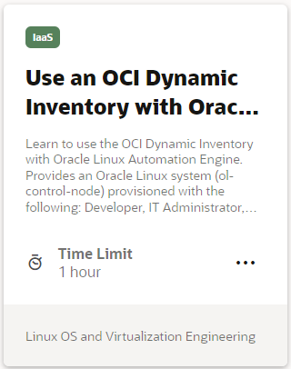

# Welcome to Oracle Linux Automation Manager Track

---
This track provides free training to help introduce you to Oracle Linux Automation Manager and improve your skills with its automation tools.

The Oracle Linux Automation Engine is an automation tool for deploying software, configuring systems, and orchestrating tasks such as upgrades and updates, in the form of playbooks.

Oracle Linux Automation Manager provides features that allow your organization to effectively manage infrastructure configuration through a browser user interface. Using Oracle Linux Automation Manager you can:
- Create and configure permissions for organizations, users, and teams that use Oracle Linux Automation Manager 
- Create projects that import Oracle Linux Automation Engine playbooks from various sources, such as a local machine or from a remote git repository
- Create an inventory which specifies the hosts where playbook tasks run
- Create job templates that specify the projects and playbooks to run
- Manually launch or schedule the launch of job templates

---

### Installing Oracle Linux Automation Manager Videos   

These videos will get you started with the installation and overview of Oracle Linux Automation Manager version 1.0.

### Installing Oracle Linux Automation Manager Hands On Lab   

Practice your skills with Oracle Linux Automation Manager version 1.0 with these free hands on labs.

### Administering Oracle Linux Automation Manager Videos   

Learn how to add users, organizations, credentials, and permissions to prepare for running jobs with Oracle Linux Automation Manager version 1.0.

### Administering Oracle Linux Automation Manager Hands On Labs   

Practice your adminstration skills with Oracle Linux Automation Manager version 1.0 with these free hands on labs.

---

### Oracle Linux Automation Manager Videos
**Coming Soon!** Oracle Linux Automation Manager Version 2.0 videos.

### Oracle Linux Automation Manager Hands On Labs
**Coming Soon!** Oracle Linux Automation Manager Version 2.0 free hands on labs.

#### [Return to Oracle Linux Training Station](../README.md)
