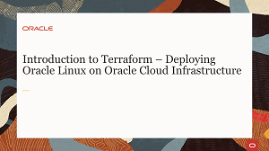
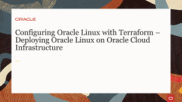
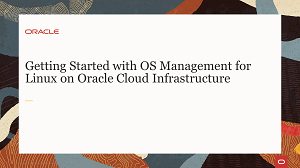
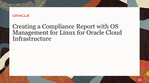
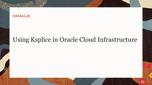
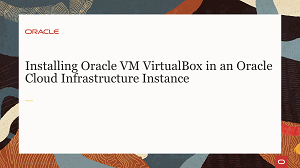
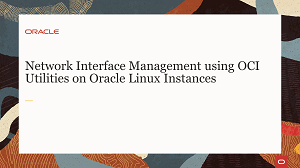
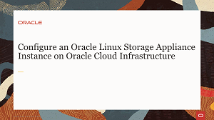
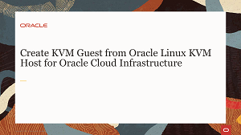

# Welcome to Linux on Oracle Cloud Infrastructure Track

---
This track provides an elearning path with step-by-step instructions and guidance for using Linux on Oracle Cloud Infrastructure.

As a Linux administrator, we walk you through building your first components on the Oracle Cloud Infrastructure and help you acquire deeper knowledge about Linux and Cloud deployment.

Get started today and see how your Linux administration helps achieve the benefits Linux brings to running your services and applications on Oracle Cloud Infrastructure. 
 
   

### Deploying Cloud Components with the Web Console Videos
Learn to provision and launch compute instances with the cloud web console to support your cloud solution in Oracle Cloud infrastructure.

<table width="1200">
<colgroup>
   <col width="600">
   <col width="600">
</colgroup>
      <tr>   
         <td valign="top"><b>Learn about these topics:</b>
            <ul>
               <li>Create Oracle Linux instance</li>
               <li>Create Oracle Autonomous Linux instance</li>
               <li>Create Windows instance</li>
               <li>Terminate instance (UEFI)</li>
               <li>Detach, Attach boot volumes</li>
               <li>Scale instances</li>
               <li>Cloud-init</li>
               <li>Terraform</li>
               </ul>
         </td>
         <td valign="top"><b>Practice the following Tutorials:</b>
            <ul>
               <li>Introduction to Terraform with Oracle Linux</li>
            </ul>
         </td>
     </tr>
</table>  
 
   

### Deploying Cloud Components Tutorial

 
 
   

### Administering Instances In Oracle Cloud Infrastructure Videos
Learn to administer compute instances using a range of tools and solutions provided to support your cloud solution in Oracle Cloud infrastructure.

<table width="1200">
<colgroup>
   <col width="600">
   <col width="600">
</colgroup>
      <tr>   
         <td valign="top"><b>Learn about these topics:</b>
            <ul>
               <li>OCI Utilities</li>
               <li>Module streams and profiles</li>
               <li>OS Management</li>
               <li>Ksplice(UEFI)</li>
               <li>GUI and VNC service</li>
               <li>Access Windows instance</li>
               <li>Oracle VM VirtualBox</li>
               </ul>
         </td>
         <td valign="top"><b>Practice the following Tutorials:</b>
            <ul>
               <li>Migrate Standalone Oracle Autonomous Linux Instances to use OS Management Service</li>
               <li>Managing Oracle Linux Module Streams and Profiles with the OS Management Service</li>
            </ul>
         </td>
     </tr>
</table>  
 
   

### Administering Instances Hands On Lab

 
 
   

### Managing Security and Access to your Cloud Videos
Learn to secure access to instances and manage traffic between virtual networks in Oracle Cloud Infrastructure.

<table width="1200">
<colgroup>
   <col width="600">
   <col width="600">
</colgroup>
      <tr>   
         <td valign="top"><b>Learn about these topics:</b>
            <ul>
               <li>SSH keys</li>
               <li>Instance network security</li>
               <li>Security lists/li>
               </ul>
         </td>
      </tr>
</table>  
 
   

 
 
   

### Networking your Oracle Cloud Infrastructure Videos
Learn to build and administer virtual networks and gateways in Oracle Cloud Infrastructure. Manage instance networking and interfaces.

<table width="1200">
<colgroup>
   <col width="600">
   <col width="600">
</colgroup>
      <tr>   
         <td valign="top"><b>Learn about these topics:</b>
            <ul>
               <li>OCI Utilities</li>
               <li>Module streams and profiles</li>
               <li>OS Management</li>
               <li>Ksplice</li>
               <li>GUI and VNC service</li>
               <li>Access Windows instances</li>
               <li>Oracle VM VirtualBox</li>
               </ul>
         </td>
         <td valign="top"><b>Practice the following Tutorials:</b>
            <ul>
               <li>Create Virtual Cloud Networks in Oracle CLoud Infrastructure</li>
            </ul>
         </td>
     </tr>
</table>  
 
   

### Networking your Oracle Cloud Infrastructure Hands On Lab

 
 

### Using Storage on Oracle Cloud Infrastructure Videos
Learn to discover and administer block volume storage and create shared cluster storage for instances.

<table width="1200">
<colgroup>
   <col width="600">
   <col width="600">
</colgroup>
      <tr>   
         <td valign="top"><b>Learn about these topics:</b>
            <ul>
               <li>Block volumes</li>
               <li>OCI Utilities for managing iSCSI storage</li>
               <li>iSCSI target and initiator</li>
               <li>OCFS2 cluster</li>
               <li>Oracle Linux Storage Appliance</li>
               <li>File system service</li>
               <li>Object storage</li>
            </ul>
         </td>
         <td valign="top"><b>Practice the following Tutorials:</b>
            <ul>
               <li>Use OCI iSCSI Utility on Oracle CLoud Infrastructure</li>
               <li>Configure iSCSI targets and initiators on Oracle Linux on Oracle Cloud Infrastructure</li>
               <li>Create an Oracle Linux Storage Appliance in Oracle Cloud Infrastructure</li>
               <li>Configure an Oracle Cluster File System on Oracle Cloud Infrastructure</li>
            </ul>
         </td>
     </tr>
</table>  
 
   

### Using Storage on Oracle Cloud Infrastructure Hands On Labs

 
 

### KVM Virtualization for Instances Videos
Learn to implement KVM virtualization in Oracle Linux instances deployed on Oracle Cloud Infrastructure.

<table width="1200">
<colgroup>
   <col width="600">
   <col width="600">
</colgroup>
      <tr>   
         <td valign="top"><b>Learn about these topics:</b>
            <ul>
               <li>Oracle KVM image</li>
               <li>Create KVM guest</li>
               <li>OCI utilities oci-kvm network and storage</li>
            </ul>
         </td>
      </tr>
</table>  
 
   

   
---
## Quiz
Test your skills on what you have learned with this quiz.   
 
<table>
    <tr>
    <td></td>
    <td><a href="https://apexapps.oracle.com/pls/apex/f?p=ST_QUIZ:200:0::::P200_QUIZ_KEY:2EE71Y">Cloud Deployment with Linux on Oracle Cloud Infrastructure Track Quiz</a></td>
  </tr>
</table>    
<b>Note:</b> To access the quiz you will need to create a Single Sign On account if you do not already have one.

---
#### [Return to Oracle Linux Training Station](../README.md)
