# Welcome to Linux on Oracle Cloud Infrastructure Track

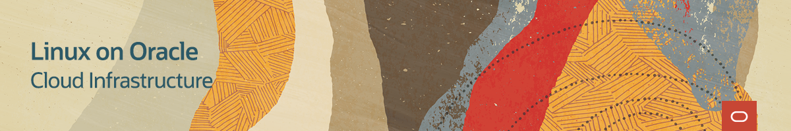
   
---
   
<table width="1200">
<colgroup>
   <col width="900">
   <col width="300">
</colgroup>
   <tr>   
      <td>
	 <h3><b>This track provides a learning path with step-by-step instructions and guidance for using Linux on Oracle Cloud Infrastructure.</b></h3>
	 <h3><b>As a Linux administrator, we walk you through building your first components on the Oracle Cloud Infrastructure and help you acquire deeper knowledge about Linux and Cloud deployment.</b></h3>
	 <h3><b>Get started today and see how your Linux administration helps achieve the benefits Linux brings to running your services and applications on Oracle Cloud Infrastructure.</b></h3>
      </td>
      <td rowspan="2">
<i>Go straight to our most popular topics. Click these links to jump to the free videos and hands on labs:</i>

         <ul>
            <li><a href="#oloci-security">Create SSH keys</a></li>
	    <li><a href="#oloci-admin">Migrate Autonomous Linux to Cloud</a></li>
	    <li><a href="#oloci-vbox">Oracle VM VirtualBox</a></li>
            <li><a href="#oloci-quiz">Take the quiz</a></li>
         </ul>
      </td>
   </tr>
   <tr>   
      <td>  </td>
   </tr>
</table>    
   
---
   

Learn to provision and launch compute instances with the cloud web console to support your cloud solution in Oracle Cloud infrastructure.

<table width="1200">
<colgroup>
   <col width="600">
   <col width="600">
</colgroup>
      <tr>   
         <td valign="top"><b>Learn about these topics:</b>
            <ul>
               <li>Create Oracle Linux instance</li>
               <li>Create Oracle Autonomous Linux instance</li>
               <li>Create Windows instance</li>
               <li>Terminate instance</li>
               <li>Detach and attach boot volumes</li>
               <li>Scale instances</li>
               <li>Cloud-init</li>
               <li>Terraform</li>
               </ul>
         </td>
         <td valign="top"><b>Practice the following Tutorials:</b>
            <ul>
               <li>Introduction to Terraform with Oracle Linux</li>
            </ul>
         </td>
     </tr>
</table>  
 
   
### Videos

### Tutorials

 
 
   
---
   

 

Learn to administer compute instances using a range of tools and solutions provided to support your cloud solution in Oracle Cloud infrastructure.

<table width="1200">
<colgroup>
   <col width="600">
   <col width="600">
</colgroup>
      <tr>   
         <td valign="top"><b>Learn about these topics:</b>
            <ul>
               <li>OCI Utilities</li>
               <li>Module streams and profiles</li>
               <li>OS Management</li>
               <li>Ksplice</li>
               <li>GUI and VNC service</li>
               <li>Access Windows instances</li>
               <li>Oracle VM VirtualBox</li>
               </ul>
         </td>
         <td valign="top"><b>Practice the following in a free lab environment:</b>
            <ul>
               <li>Migrate Standalone Oracle Autonomous Linux Instances to use OS Management Service</li>
               <li>Managing Oracle Linux Module Streams and Profiles with the OS Management Service</li>
            </ul>
             
            
<a href="https://youtu.be/HOB5dhbcAyo">Click here to learn about using the free hands on labs</a>

            

 
         </td>
     </tr>
</table>  
 
   
### Videos

[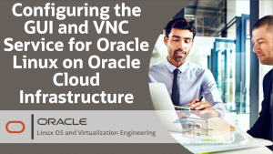](https://youtu.be/B6et8JZFylA)

### Hands On Labs

[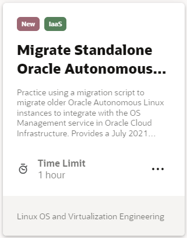](https://luna.oracle.com/lab/8848ec22-81cd-46d5-aeab-dd2dae36118b)
[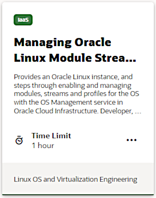](https://luna.oracle.com/lab/6abfafd9-749e-4b28-93ea-830b6046501d) 
 
   
---
   

Learn to secure access to instances and manage traffic between virtual networks in Oracle Cloud Infrastructure.

<table width="1200">
<colgroup>
   <col width="600">
   <col width="600">
</colgroup>
      <tr>   
         <td valign="top"><b>Learn about these topics:</b>
            <ul>
               <li>SSH keys</li>
               <li>Instance network security</li>
               <li>Security lists</li>
            </ul>
         </td>
      </tr>
</table>  
 
   
### Videos

[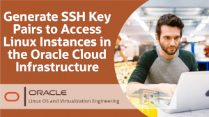](https://youtu.be/v5fGdgIrdd0)

[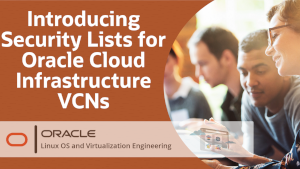](https://youtu.be/1AIXULHjabQ) 
 
   
---   
   

Learn to build and administer virtual networks and gateways in Oracle Cloud Infrastructure. Manage instance networking and interfaces.

<table width="1200">
<colgroup>
   <col width="600">
   <col width="600">
</colgroup>
      <tr>   
         <td valign="top"><b>Learn about these topics:</b>
            <ul>
               <li>Oracle Cloud Infrastructure networks</li>
               <li>Create Virtual Cloud Networks</li>
               <li>VCN Internet Gateway</li>
               <li>Remove a VCN</li>
               <li>Add secondary VNIC</li>
               <li>OCI Utilities network management</li>
            </ul>
         </td>
         <td valign="top"><b>Practice the following in a free lab environment:</b>
            <ul>
               <li>Create Virtual Cloud Networks in Oracle Cloud Infrastructure</li>
            </ul>
             
            
<a href="https://youtu.be/HOB5dhbcAyo">Click here to learn about using the free hands on labs</a>

            

 
         </td>
     </tr>
</table>  
 
   
### Videos

[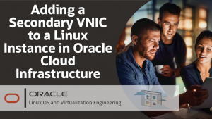](https://youtu.be/AHOx8NV3iYA)

[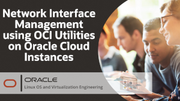](https://youtu.be/ZhbVYs1RBZ8)

### Hands On Labs

[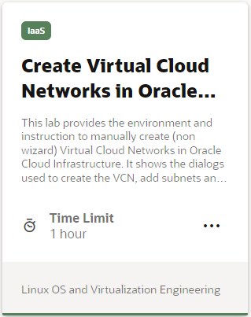](https://luna.oracle.com/lab/5a3f5ad9-7931-43d8-bcdb-40884d6a100f) 
 

---

Learn to discover and administer block volume storage and create shared cluster storage for instances.

<table width="1200">
<colgroup>
   <col width="600">
   <col width="600">
</colgroup>
      <tr>   
         <td valign="top"><b>Learn about these topics:</b>
            <ul>
               <li>Block volumes</li>
               <li>OCI Utilities for managing iSCSI storage</li>
               <li>iSCSI target and initiator</li>
               <li>OCFS2 cluster</li>
               <li>Oracle Linux Storage Appliance</li>
               <li>File system service</li>
               <li>Object storage</li>
            </ul>
         </td>
         <td valign="top"><b>Practice the following in a free lab environment:</b>
            <ul>
               <li>Use OCI iSCSI Utility on Oracle Cloud Infrastructure</li>
               <li>Configure iSCSI targets and initiators on Oracle Linux on Oracle Cloud Infrastructure</li>
               <li>Create an Oracle Linux Storage Appliance in Oracle Cloud Infrastructure</li>
               <li>Configure an Oracle Cluster File System on Oracle Cloud Infrastructure</li>
            </ul>
            
<a href="https://youtu.be/HOB5dhbcAyo">Click here to learn about using the free hands on labs</a>

            

 
         </td>
     </tr>
</table>  
 
   
### Videos

[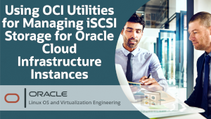](https://youtu.be/A0cis4ZohVo)

### Hands On Labs

[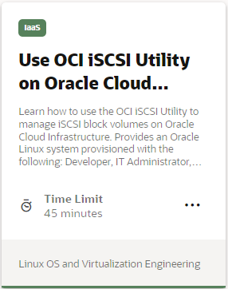](https://luna.oracle.com/lab/dd23fba0-9e2b-4a62-b86c-bea4fbc08f9d)
[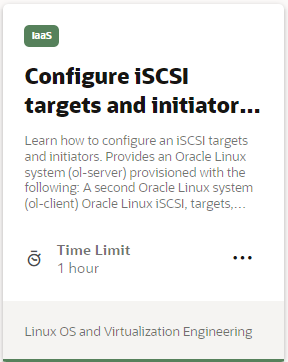](https://luna.oracle.com/lab/f85faa38-5476-41a0-951e-56dd86a8ba78)
[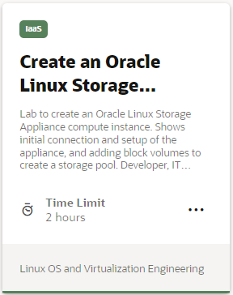](https://luna.oracle.com/lab/d57199a3-83f5-4ce9-97f8-feacf9e3db31)
[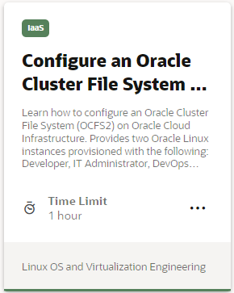](https://luna.oracle.com/lab/a7e62a2a-10d0-4b11-a317-bf559c99b148) 
 

---

Learn to implement KVM virtualization in Oracle Linux instances deployed on Oracle Cloud Infrastructure.

<table width="1200">
<colgroup>
   <col width="600">
   <col width="600">
</colgroup>
      <tr>   
         <td valign="top"><b>Learn about these topics:</b>
            <ul>
               <li>Use Oracle KVM image</li>
               <li>Create KVM guest</li>
               <li>OCI utilities oci-kvm network and storage</li>
            </ul>
         </td>
      </tr>
</table>  
 
   
### Videos

   
---

Learn about integrating Oracle VM VirtualBox virtualization with Oracle Cloud Infrastructure.

<table width="1200">
<colgroup>
   <col width="600">
   <col width="600">
</colgroup>
      <tr>   
         <td valign="top"><b>Learn about these topics:</b>
            <ul>
               <li>Integrating VirtualBox with Oracle Cloud Oracle Infrastructure</li>
               <li>Create and manage cloud instances from VirtualBox</li>
               <li>Import and export virtual machines between VirtualBox and the cloud</li>
               <li>Create cloud infrastructure networks from VirtualBox</li>
            </ul>
         </td>
      </tr>
</table>  
 
   
Watch all the free content here on the Oracle VM VirtualBox Training Track: **[Oracle VM VirtualBox Training Track](../VBOX/vbox.md)**

---

   
   
Test your skills on what you have learned with this quiz.   
 
<table>
    <tr>
    <td></td>
    <td><a href="https://apexapps.oracle.com/pls/apex/f?p=ST_QUIZ:200:0::::P200_QUIZ_KEY:2EE71Y">Cloud Deployment with Linux on Oracle Cloud Infrastructure Track Quiz</a></td>
  </tr>
</table>    
<b>Note:</b> To access the quiz you will need to create a Single Sign On account if you do not already have one.

### Resources

Following page provides additional product information:

- [Oracle Cloud Infrastructure Documentation](https://docs.oracle.com/en-us/iaas/Content/home.htm)
- [Linux on Oracle Cloud Infrastructure Training YouTube Playlist](https://www.youtube.com/playlist?list=PLKCk3OyNwIzu51n3L6dxHgKRy8CayIBXI)

---
#### [Return to Oracle Linux Training Station](../README.md)
