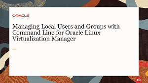
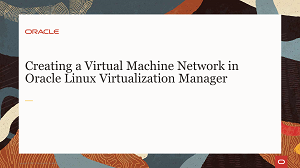
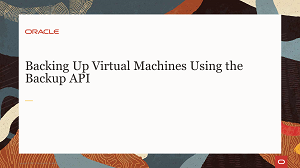
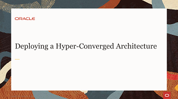
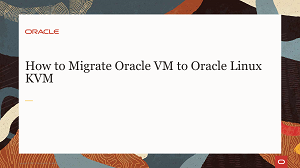
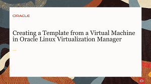
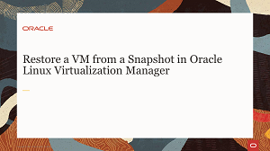
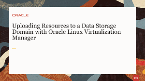

# Welcome to Oracle Linux Virtualization Manager Track

---
This track contains videos to facilitate your usage of the technologies and tools used by Oracle Linux Virtualization Manager. Oracle Linux Virtualization Manager is an open-source distributed server virtualization solution, easily deployed to configure, monitor, and manage an Oracle Linux Kernel-based Virtual Machine (KVM) environment with enterprise-grade performance and support from Oracle.

On these pages you will find material such as videos, documents and useful resource links covering areas including the following:
- Implementing and administering the system as a large scale, centralized management for server virtualization.
- Building infrastructure and adding Virtual Machines and resources using fully featured software targeted to enterprise systems and deployments.

Information and videos presented here cover technologies and components to help you expand your learning of the Oracle Linux Virtualization Manager system.

### Administration and Deployment Videos
The following content will introduce you to the administration of the Oracle Linux Virtualization Manager environment as well as the deployment of hosts and architectural resources.

### Managing Virtual Machines Videos
The following content will introduce you to Oracle Linux Virtualization Manager Virtual Machine implementation and demonstrates deployment of VMs through the Administration Portal and VM Portal graphical interfaces.

### Managing Storage Videos
The following content will introduce you to storage concepts and how to create, attach and maintain various storage types in your Oracle Linux Virtualization Manager enterprise environment.

### Backup and Recovery Videos
The following content will introduce you to Oracle Linux Virtualization Manager backup and recovery solutions.

### Oracle Enterprise manager for Oracle Linux Virtualization Manager Videos
The following content will introduce you to Cloud Administration of the Oracle Linux Virtualization Manager with Oracle Enterprise Manager 13c Cloud Control.

---
## Quiz
Test your skills on what you have learned with this quiz.   
 
<table>
    <tr>
    <td></td>
    <td><a href="https://apexapps.oracle.com/pls/apex/f?p=ST_QUIZ:200:0::::P200_QUIZ_KEY:CMMO0UH">Oracle Linux Virtualization Manager Track Quiz</a></td>
  </tr>
</table>    
<b>Note:</b> To access the quiz you will need to create a Single Sign On account if you do not already have one.

---
#### [Return to Oracle Linux Training Station](../README.md)
