# Welcome to Oracle Private Cloud Appliance Track

---
This track contains videos to facilitate your learning of the administrative and user tasks performed with the technologies and tools of the Oracle Private Cloud Appliance.

On these pages you will find material such as videos, documents and useful resource links covering areas including the following:
- Tasks performed from the Service Enclave.
- Tasks performed from the Compute Enclave.

Information and videos presented here cover technologies and components to help you expand your learning of the Oracle Private Cloud Appliance.

The Oracle Private Cloud Appliance runs its own specific and separate administration area known as the Service Enclave. The Service Enclave is the part of the system where the appliance infrastructure is controlled. Access is closely monitored and restricted to privileged administrators. Functionality provided by the Service Enclave includes hardware and capacity management, tenancy management, system and component upgrade, system backup and restore, monitoring and tools for service and support, and so on.

This section provides video training for Day 0 configuration and for administrator tasks performed from the Service Enclave. To access the Service Enclave, you use either the Service Web UI or Service CLI.

[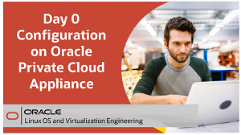](https://youtu.be/pkeW3uqt11w)
[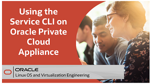](https://youtu.be/zgX87aB32qw)
[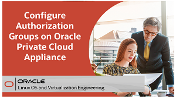](https://youtu.be/QCsCyFWPea0)
[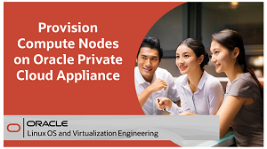](https://youtu.be/aQlRAYuLMwo)
[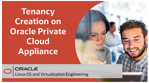](https://youtu.be/LBN5NHbpEnk)
[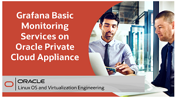](https://youtu.be/humJ2jiovBs)
[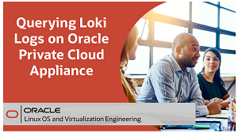](https://youtu.be/HiGz8ruDtas)
[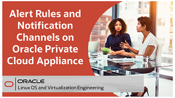](https://youtu.be/Qmj_V8TAQXs)
[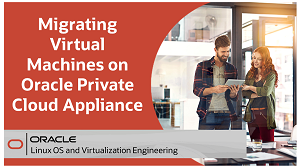](https://youtu.be/_YjZMVApxaE)
[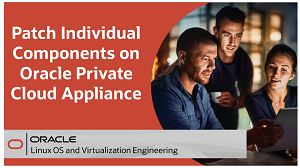](https://youtu.be/v_5ASLflVxU)
 
 

The Compute Enclave offers functionality to users of the cloud environment, and are very similar in operation to the corresponding Oracle Cloud Infrastructure services. Users of the Compute Enclave have certain permissions to enable the deployment of customer workloads through compute instances and associated resources. Cloud services include the compute and storage services, identity and access management, and networking.

This section provides video training for administrator and user tasks performed from the Compute Enclave. To access the Compute Enclave, you use either the Compute Web UI or OCI CLI.
 
 

[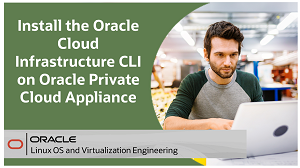](https://youtu.be/SNtGCBl_yZE)
[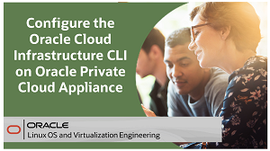](https://youtu.be/x2iWGXIa-rQ)
 
 

[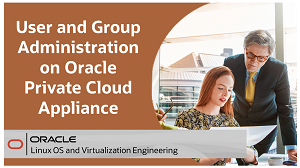](https://youtu.be/D0CxmJ6pn4U)
[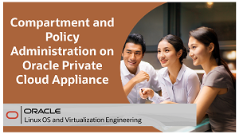](https://youtu.be/KV4sQOWXab8)
[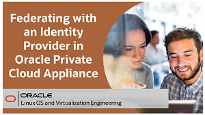](https://youtu.be/tsBn5UQSJ24)
[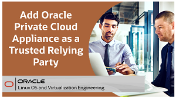](https://youtu.be/wWm4TrPoEtI)

 
 

[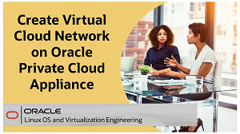](https://youtu.be/OCasg_HQ3LI)
[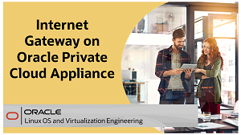](https://youtu.be/H8GwY7i720A)
[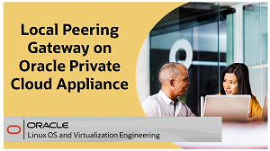](https://youtu.be/pxdkxjajhO0)
 
 

[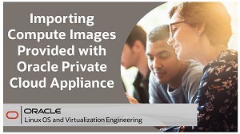](https://youtu.be/fToYmmf6NFk)
[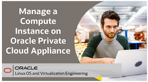](https://youtu.be/lxD2w1Chyxg)
[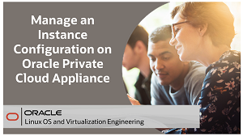](https://youtu.be/B4aW0hzDfc4)
[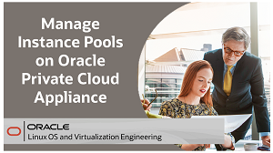](https://youtu.be/VfSKX7WxNX8)
 
 

[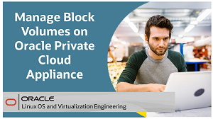](https://youtu.be/s5N6mGxUNew)
[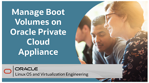](https://youtu.be/Vo4119i8HsU)
[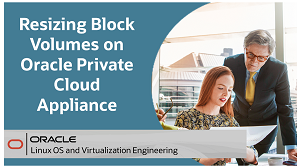](https://youtu.be/bO2kM9tSPU0)
[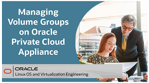](https://youtu.be/YlwfUWbXsT8)
[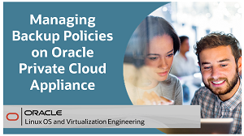](https://youtu.be/6R_61dHmCMY)
[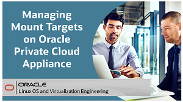](https://youtu.be/bTmckStW_wY)
[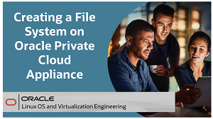](https://youtu.be/lB03H7YJP0Q)

---
## Oracle Private Cloud Appliance Foundations Training   
For even more training on Oracle Private Cloud Appliance, use this link to access further foundation level training.   

<b>Note:</b> To access the learning path content you will need to create a Single Sign On account if you do not already have one.   

### [Oracle Private Cloud Appliance Foundations course](https://www.oracle.com/goto/pcafoundations)

### Resources

Following page provides additional product information:

- [Oracle Private Cloud Appliance Documentation](https://docs.oracle.com/en/engineered-systems/private-cloud-appliance/)

---
#### [Return to Oracle Linux Training Station](../README.md)
