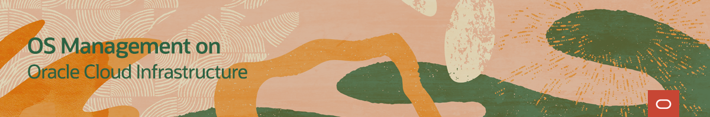

# Welcome to OS Management on Oracle Cloud Infrastructure Track

---
The Oracle Cloud Infrastructure OS Management service allows you to manage updates and patches for the operating system environment on your Oracle Cloud Infrastructure instances.

On these pages, you will find videos, documents, and other useful resources on topics such as:
- Getting Started with OS Management
- Installing and Patching a Windows instance
- Checking the status of the Oracle Cloud Agent

### Installation
One of the first requirements to use the OS Management Service is to have a running instance of Linux or Windows.

### Working with OS Management Videos
These videos will provide information to get started and work with the OS Management Service on Linux and Windows instances.

### Working with OS Management Hands On Lab

#### [Return to Oracle Linux Training Station](../README.md)
