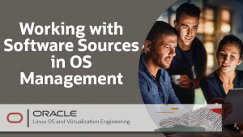

# Welcome to OS Management on Oracle Cloud Infrastructure Track

---

The OS Management Service allows you to manage updates and patches for the operating system environment on your Oracle Cloud Infrastructure instances. The OS Management Service also provides options for discovering and monitoring resources on your instances.

On these pages, you will find videos, documents, and other useful resources on topics such as:
- Getting Started with OS Management
- Installing and Patching a Windows instance
- Checking the status of the Oracle Cloud Agent
 
      

<h2>Videos</h2>
One of the first requirements to use the OS Management Service is to have a running instance of Linux or Windows.

---
 
   

<h2>Videos</h2>
These videos will provide information to get started and work with the OS Management Service on Linux and Windows instances.

<h2>Hands On Lab</h2>

Practice your skills with the OS Management Service with these free hands on labs.

<a href="https://youtu.be/HOB5dhbcAyo">Click here to learn about using the free hands on labs</a>

 

---
 

<h2>Resources</h2>

Following page provides additional product information:

- [OS Management Documentation](https://docs.oracle.com/en-us/iaas/os-management/home.htm)
- [OS Management Training YouTube Playlist](https://www.youtube.com/playlist?list=PLKCk3OyNwIzsn5mtWgjb_HS7GJoKa2rMn)

#### [Return to Oracle Linux Training Station](../README.md)
