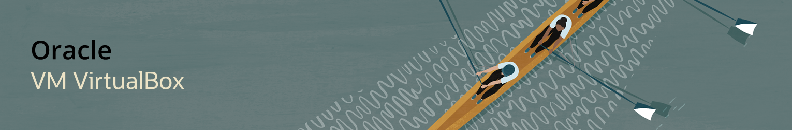
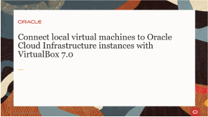
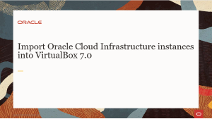
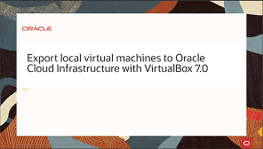
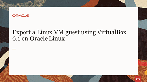

# Welcome to Oracle VM VirtualBox Track

---
This track allows you to explore Oracle VM VirtualBox to help you grow your skillset using free videos and hands-on tutorials and labs. Whether you are working with traditional, cloud-based, or virtual environments, these skills will progress your knowledge into becoming better at testing, developing, demonstrating, and deploying solutions across multiple platforms from ultra-books to high-end server class hardware and cloud infrastructure, using a lightweight, easy to use, fast and powerful virtualization engine.

---

 
 

---

 
 

---

   
   
Test your skills on what you have learned about VirtualBox on Oracle Linux with this quiz.   
 
<table>
    <tr>
    <td></td>
    <td><a href="https://apexapps.oracle.com/pls/apex/f?p=ST_QUIZ:200:0::::P200_QUIZ_KEY:31YKIU">Oracle Linux Virtualbox Quiz</a></td>
  </tr>
</table>    
<b>Note:</b> To access the quiz you will need to create a Single Sign On account if you do not already have one.
