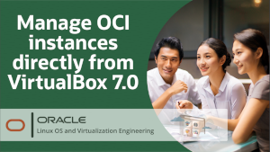
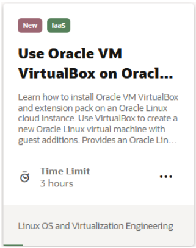
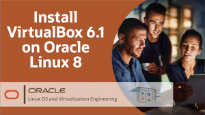
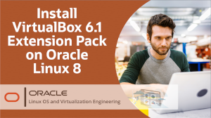
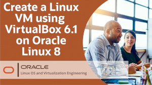

# Welcome to Oracle VM VirtualBox Track

---
This track allows you to explore Oracle VM VirtualBox to help you grow your skillset using free videos and hands-on tutorials and labs. Whether you are working with traditional, cloud-based, or virtual environments, these skills will progress your knowledge into becoming better at testing, developing, demonstrating, and deploying solutions across multiple platforms from ultra-books to high-end server class hardware and cloud infrastructure, using a lightweight, easy to use, fast and powerful virtualization engine.

---

 
 

## VirtualBox 7.0 Hands On Labs
Follow guided step-by-step procedures to complete specific tasks with VirtualBox in an Oracle-provided free lab environment. Alternatively, you can perform the lab steps on your own environment.

<a href="https://youtu.be/HOB5dhbcAyo">Click here to learn about using the free hands on labs</a>

---

 
 

---

   
   
Test your skills on what you have learned about VirtualBox on Oracle Linux with this quiz.   
 
<table>
    <tr>
    <td></td>
    <td><a href="https://apexapps.oracle.com/pls/apex/f?p=ST_QUIZ:200:0::::P200_QUIZ_KEY:31YKIU">Oracle Linux Virtualbox Quiz</a></td>
  </tr>
</table>    
<b>Note:</b> To access the quiz you will need to create a Single Sign On account if you do not already have one.

### Resources

Following page provides additional product information:

- [Oracle VM VirtualBox Documentation](https://docs.oracle.com/en/virtualization/virtualbox/index.html)
- [Oracle VM VirtualBox Training YouTube Playlist](https://www.youtube.com/playlist?list=PLKCk3OyNwIzsbt_qDAXLMF5oFUhEkgbUM)

---

#### [Return to Oracle Linux Training Station](../README.md)
